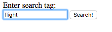
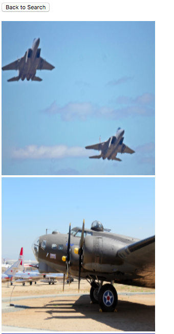

clarifai-search
===============

Description
-----------

* A simple MVP of an image search engine.
* Uses the Clarifai Predict API to tag images.
* Written in Go.

The project uses [Redis](http://redis.io), to store results.  Please install it and ensure it is running before starting.

Redis Setup
-----------
     wget http://download.redis.io/releases/redis-4.0.2.tar.gz
     tar xzf redis-4.0.2.tar.gz
     cd redis-4.0.2
     make

To start a server,

     src/redis-server

Setup
-----

     cd $GOPATH/src
     mkdir -p github.com/swiftdiaries
     cd github.com/swiftdiaries/
     git clone https://github.com/swiftdiaries/clarifai-search
     cd clarifai-search

Installation
------------     
     go install github.com/swiftdiaries/clarifai-search/searchbytag

You should see an application in your bin directory

     ls -la $GOPATH/bin | grep searchbytag

Command Line
------------

From the command line you can, (Ensure you are in the root of the project directory when executing the following) 
     
     $GOPATH/bin/searchbytag

You should now see a HTML page with a Text Field, Enter a Search Tag to see results. 
Sample Text Field
-----------------
  
Sample Results
--------------

     
     
